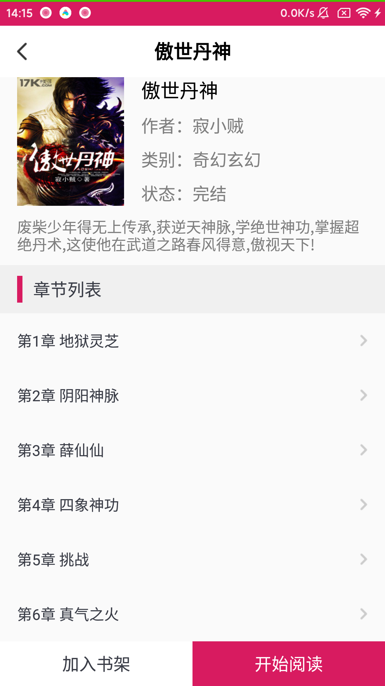
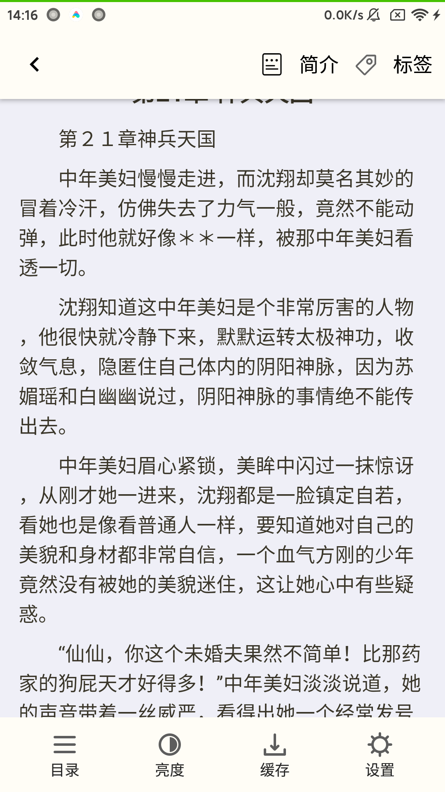
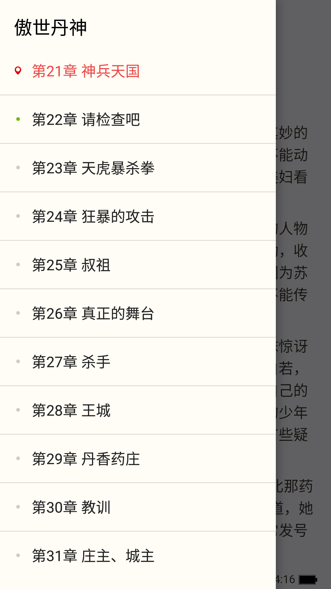
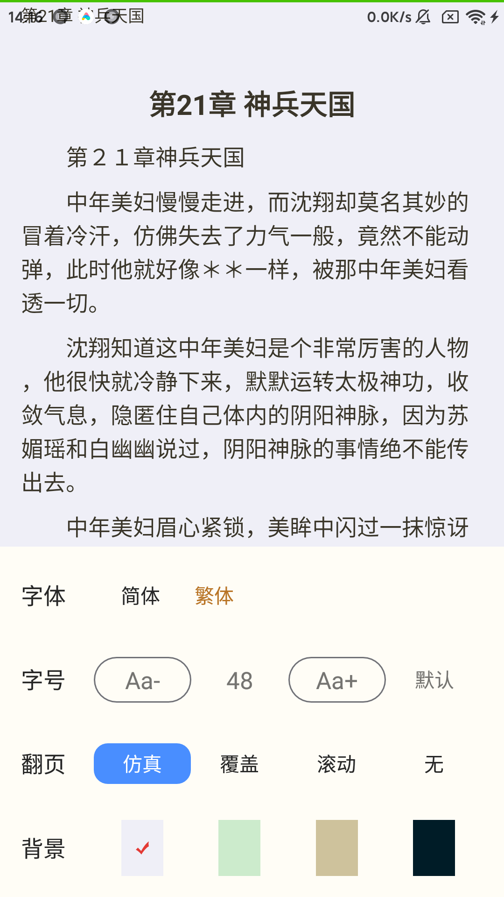
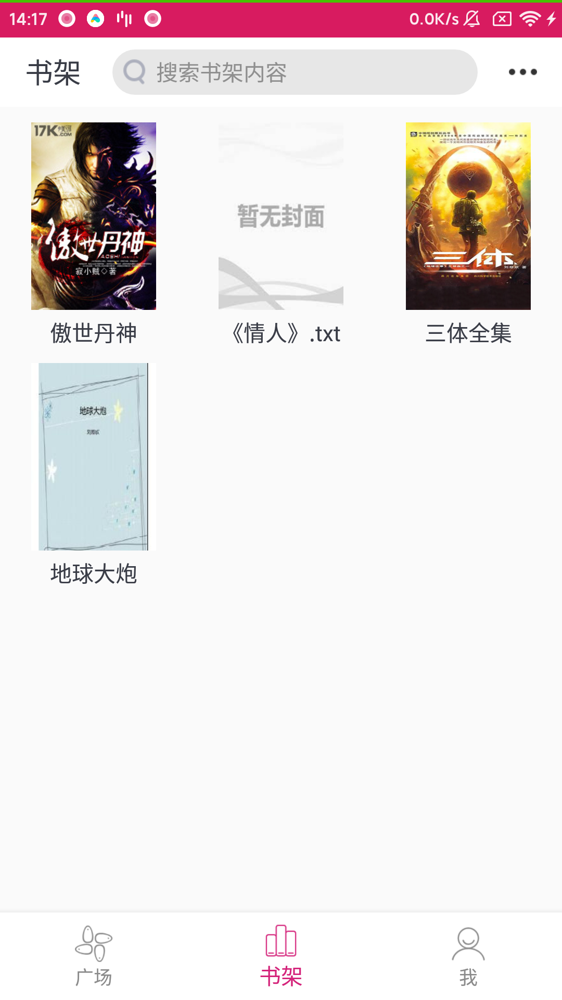
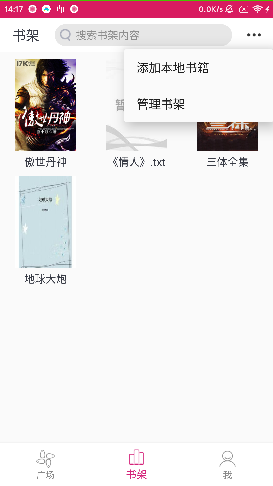
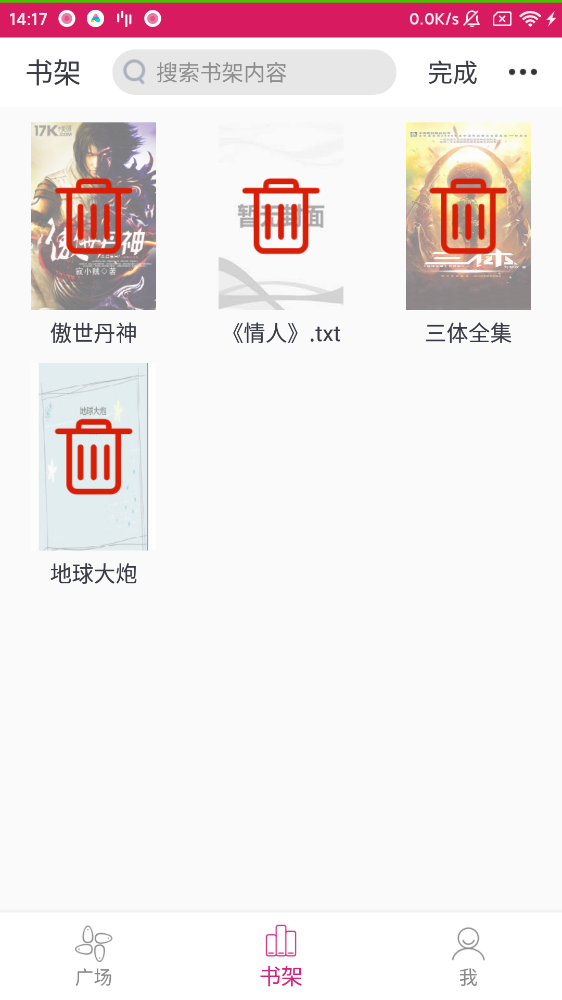
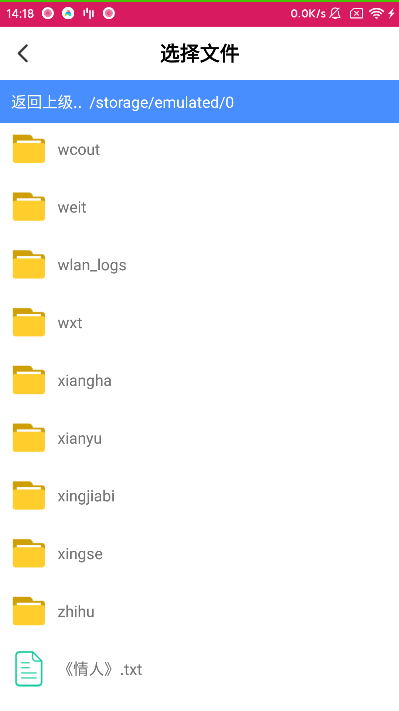
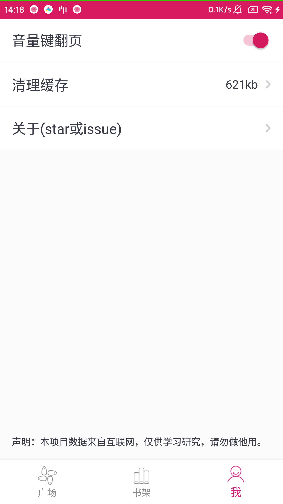

# 微阅读

这是一款基于kotlin的免费Android小说应用。

本项目参考了[https://github.com/390057892/reader](https://github.com/390057892/reader) 项目，

将原项目的阅读功能单独打包成了readerlib库来使用，摒除了原项目繁杂的依赖关系，可以方便的应用于其他项目。

在这里对原作者表示衷心的感谢！

## 项目明细

环境：

android studio 3.5

kotlin_version 1.3.61

kotlin_coroutines 1.3.3

## 主要功能

1.在线搜索，分类浏览，查看详情

2.加入本地书架阅读

3.阅读偏好设置

4.记录搜索历史

5.记录阅读进度

6.添加本地书籍到书架

7.管理书架

(更多新增功能、UI优化、bug修复还在陆续填坑中...)

## 预览

    
    
    
    
    
    
    
    
    
    
    
    
    
    

## 下载体验

 
[app/release/app-release.apk](app/release/app-release.apk)

## 声明

本项目所有数据均来自互联网，仅供学习研究，请勿做他用。
